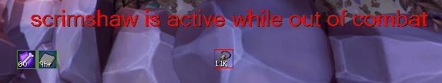

# What's In Your Pocket?

Uses chat active/no longer active messaging to alert you when you leave your Pocket Slot enabled when out of combat... or when you forget to active it while in combat!

Grimoire/God Book/Scrimshaw

## Installation

 

To install WIYP? copy & paste this link into your browser:
alt1://addapp/https://nadyanayme.github.io/WhatsInYourPocket/dist/appconfig.json

## Features

- Alert when Pocket slot is Inactive while in combat
- Alert when Pocket slot is Active while out of combat

\* You are considered "in combat" if you have an active target. You are considered "out of combat" if you do not have an active target.

If you encounter any other bugs - please submit an issue and I'll investigate it.
